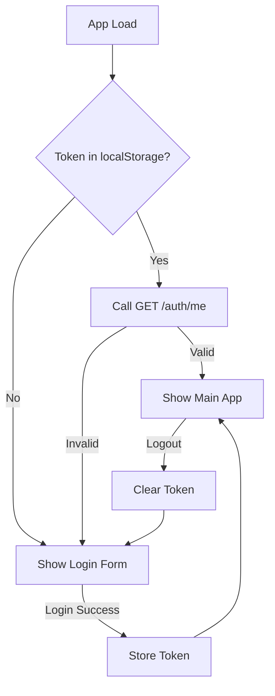

# Task 3: Frontend Auth

## Goal

Auth UI and state management with Zustand.

## Files to Create/Modify

```
frontend/src/
├── components/
│   └── auth/
│       └── LoginForm.tsx
├── store/
│   └── authStore.ts
└── services/
    └── auth.ts  (update existing api.ts)
```

## Implementation Steps

### 1. Create Auth Store (Zustand)

`frontend/src/store/authStore.ts`:

```typescript
import { create } from 'zustand'
import { persist } from 'zustand/middleware'

interface User {
  username: string
  role: 'admin' | 'user'
}

interface AuthStore {
  token: string | null
  user: User | null
  isAuthenticated: boolean
  
  login: (username: string, password: string) => Promise<void>
  logout: () => void
  checkAuth: () => Promise<void>
}

export const useAuthStore = create<AuthStore>()(
  persist(
    (set) => ({
      token: null,
      user: null,
      isAuthenticated: false,

      login: async (username, password) => {
        const response = await fetch('/api/auth/login', {
          method: 'POST',
          headers: { 'Content-Type': 'application/json' },
          body: JSON.stringify({ username, password }),
        })

        if (!response.ok) {
          throw new Error('Invalid credentials')
        }

        const { accessToken, user } = await response.json()
        
        set({
          token: accessToken,
          user,
          isAuthenticated: true,
        })
      },

      logout: () => {
        set({
          token: null,
          user: null,
          isAuthenticated: false,
        })
      },

      checkAuth: async () => {
        const state = useAuthStore.getState()
        if (!state.token) return

        try {
          const response = await fetch('/api/auth/me', {
            headers: { 'Authorization': `Bearer ${state.token}` },
          })

          if (!response.ok) {
            throw new Error('Token invalid')
          }

          const user = await response.json()
          set({ user, isAuthenticated: true })
        } catch {
          set({ token: null, user: null, isAuthenticated: false })
        }
      },
    }),
    {
      name: 'auth-storage',
      partialize: (state) => ({ token: state.token }), // Only persist token
    }
  )
)
```

### 2. Create Login Form

`frontend/src/components/auth/LoginForm.tsx`:

```tsx
import { useState } from 'react'
import { useAuthStore } from '../../store/authStore'
import { Button } from '../ui/Button'
import { Input } from '../ui/Input'

export function LoginForm() {
  const [username, setUsername] = useState('')
  const [password, setPassword] = useState('')
  const [error, setError] = useState('')
  const [loading, setLoading] = useState(false)
  
  const login = useAuthStore(state => state.login)

  const handleSubmit = async (e: React.FormEvent) => {
    e.preventDefault()
    setError('')
    setLoading(true)

    try {
      await login(username, password)
    } catch (err) {
      setError('Invalid username or password')
    } finally {
      setLoading(false)
    }
  }

  return (
    <div className="min-h-screen flex items-center justify-center bg-gray-50 dark:bg-gray-900">
      <div className="max-w-md w-full space-y-8 p-8 bg-white dark:bg-gray-800 rounded-lg shadow">
        <h2 className="text-2xl font-bold text-center">Sign In</h2>
        
        <form onSubmit={handleSubmit} className="space-y-4">
          <Input
            type="text"
            placeholder="Username"
            value={username}
            onChange={(e) => setUsername(e.target.value)}
            required
          />
          
          <Input
            type="password"
            placeholder="Password"
            value={password}
            onChange={(e) => setPassword(e.target.value)}
            required
          />

          {error && (
            <div className="text-red-500 text-sm">{error}</div>
          )}

          <Button type="submit" disabled={loading} className="w-full">
            {loading ? 'Signing in...' : 'Sign In'}
          </Button>
        </form>
      </div>
    </div>
  )
}
```

### 3. Update API Service

Modify `frontend/src/services/api.ts` to add auth header:

```typescript
import { useAuthStore } from '../store/authStore'

// Add interceptor to attach token
export async function apiRequest(url: string, options: RequestInit = {}) {
  const token = useAuthStore.getState().token
  
  const headers = {
    'Content-Type': 'application/json',
    ...options.headers,
  }

  if (token) {
    headers['Authorization'] = `Bearer ${token}`
  }

  const response = await fetch(url, {
    ...options,
    headers,
  })

  // Handle 401 - unauthorized
  if (response.status === 401) {
    useAuthStore.getState().logout()
    window.location.href = '/login'
  }

  return response
}
```

### 4. Update App Component

`frontend/src/App.tsx`:

```tsx
import { useEffect } from 'react'
import { useAuthStore } from './store/authStore'
import { LoginForm } from './components/auth/LoginForm'
import { Layout } from './components/layout/Layout'

export function App() {
  const { isAuthenticated, checkAuth } = useAuthStore()

  // Check if ALLOW_ANONYMOUS on app load
  useEffect(() => {
    // Try to restore session from token
    checkAuth()
  }, [checkAuth])

  if (!isAuthenticated) {
    return <LoginForm />
  }

  return (
    <Layout>
      {/* Your main app */}
    </Layout>
  )
}
```

### 5. Update Header with Logout

`frontend/src/components/layout/Header.tsx`:

```tsx
import { useAuthStore } from '../../store/authStore'
import { Button } from '../ui/Button'

export function Header() {
  const { user, logout } = useAuthStore()

  return (
    <header className="...">
      <div className="flex items-center gap-4">
        <span>Welcome, {user?.username}</span>
        {user?.role === 'admin' && <span className="text-xs">(Admin)</span>}
        <Button onClick={logout} variant="outline">Logout</Button>
      </div>
    </header>
  )
}
```

### 6. Role-Based UI

Simple conditional rendering based on role:

```tsx
// In any component
import { useAuthStore } from '../../store/authStore'

export function SomeComponent() {
  const user = useAuthStore(state => state.user)

  return (
    <div>
      {user?.role === 'admin' && (
        <Button>Admin Only Feature</Button>
      )}
    </div>
  )
}
```

### 7. Anonymous Mode Support

Frontend needs to check if anonymous mode is enabled:

```typescript
// In App.tsx
useEffect(() => {
  const init = async () => {
    // Try to restore token first
    await checkAuth()
    
    // If no token, check if anonymous allowed
    if (!useAuthStore.getState().isAuthenticated) {
      const response = await fetch('/api/auth/config')
      const { allowAnonymous } = await response.json()
      
      if (allowAnonymous) {
        // Skip login, mark as authenticated with admin role
        useAuthStore.setState({ 
          isAuthenticated: true,
          user: { username: 'anonymous', role: 'admin' }
        })
      }
    }
  }
  
  init()
}, [])
```

Backend `JwtAuthGuard` returns `true` immediately when `ALLOW_ANONYMOUS=true`, so requests work without tokens.

## UI Flow



## Token Storage

- Store only token in localStorage (persist via Zustand)
- User info fetched on app load
- Auto-logout on 401 response

## Files Summary

- `authStore.ts` - State management
- `LoginForm.tsx` - UI
- Update `api.ts` - Add auth header