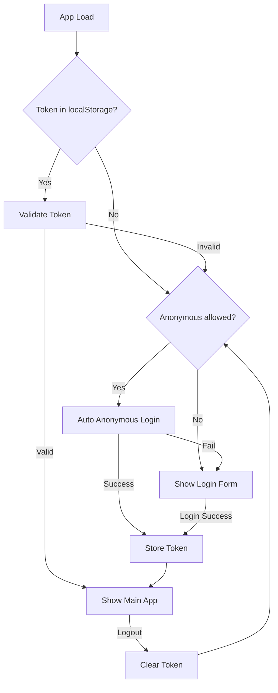

# Task 3: Frontend Auth Integration

## Goal

Implement authentication UI and state management in the React frontend.

## Files to Create/Modify

```
frontend/src/
├── components/
│   └── auth/
│       └── LoginForm.tsx
├── hooks/
│   └── useAuth.ts
├── services/
│   └── auth.ts
├── store/
│   └── authStore.ts
└── types/
    └── auth.ts
```

## Implementation Steps

### 1. Create Auth Types

`frontend/src/types/auth.ts`:

```typescript
interface User {
  username: string
  features: string[]
}

interface AuthState {
  user: User | null
  token: string | null
  isAuthenticated: boolean
  login: (username: string, password: string) => Promise<void>
  logout: () => void
  checkAuth: () => void
}
```

### 2. Create Auth Service

`frontend/src/services/auth.ts`:

```typescript
const authService = {
  getConfig: async () => {
    // GET /auth/config - returns { allowAnonymous: boolean }
  },
  login: async (username: string, password: string) => {
    // POST /auth/login
  },
  loginAnonymous: async () => {
    // POST /auth/anonymous
  },
  me: async () => {
    // GET /auth/me
  },
  getFeatures: async () => {
    // GET /auth/features
  }
}
```

### 3. Create Auth Store (Zustand)

`frontend/src/store/authStore.ts`:

- Store user, token, isAuthenticated
- Persist token to localStorage
- Auto-restore session on page load
- Provide login/logout actions

### 4. Create Login Form

`frontend/src/components/auth/LoginForm.tsx`:

- Username/password inputs
- Submit button with loading state
- Error message display
- Redirect on successful login

### 5. Create Auth Hook

`frontend/src/hooks/useAuth.ts`:

- Wrap auth store for convenience
- Provide `hasFeature(feature)` helper
- Return auth state and actions

### 6. Update API Service

Modify `frontend/src/services/api.ts`:

- Add auth token to requests automatically
- Handle 401 responses (redirect to login)
- Add interceptor for token refresh (optional)

### 7. Protect Routes

Create protected route wrapper or add auth check in `App.tsx`:

```tsx
function App() {
  const { isAuthenticated, allowAnonymous } = useAuth()
  
  // Auto-login anonymous if allowed and not authenticated
  useEffect(() => {
    if (!isAuthenticated && allowAnonymous) {
      loginAnonymous()
    }
  }, [])
  
  if (!isAuthenticated) {
    return <LoginForm />
  }
  
  return <MainApp />
}
```

### 8. Anonymous Login Flow

On app start:
1. Check localStorage for existing token
2. If no token, call `GET /auth/config` to check if anonymous allowed
3. If `allowAnonymous: true`, auto-call `POST /auth/anonymous`
4. Store returned token and proceed to main app
5. If anonymous not allowed, show login form

### 9. Update Layout

Modify `frontend/src/components/layout/Layout.tsx`:

- Add logout button in header
- Show current username
- Hide elements based on features

## UI Flow



## Token Storage

- Store JWT in `localStorage` as `auth_token`
- Clear on logout
- Auto-add to API requests via header

## API Integration

Update API base URL handling:
- Auth endpoints: `/auth/*`
- Protected endpoints require `Authorization: Bearer <token>`

## Error Handling

- Show error toast on login failure
- Redirect to login on 401
- Show message on session expired