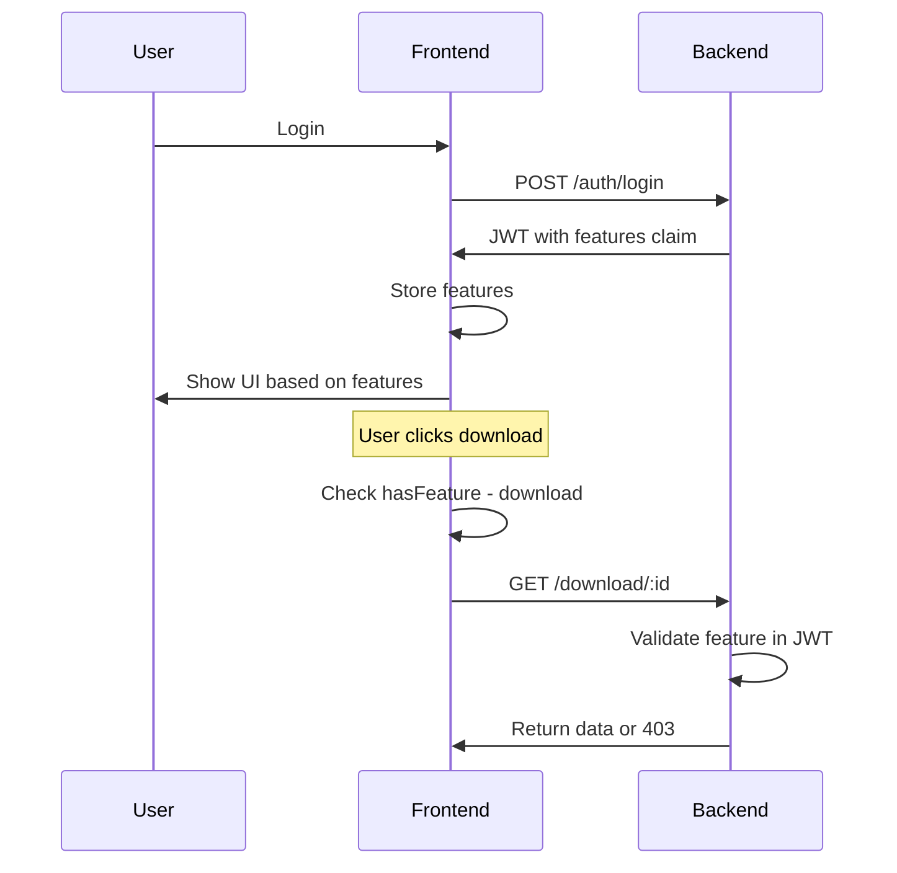

# Task 4: Feature Flags System

## Goal

Implement feature flags that control frontend UI elements based on user permissions from JWT claims.

## How It Works

1. User logs in → JWT contains `features` array in claims
2. Frontend stores features from token
3. UI components check features to show/hide elements
4. Backend can also validate features for API access

## Implementation Steps

### 1. Define Standard Features

| Feature | UI Impact |
|---------|-----------|
| `download` | Show download button |
| `settings` | Show settings page/menu |

### 2. Backend: Feature Guard

Create `FeaturesGuard` for protecting routes:

```typescript
@RequireFeatures('download')
@Get('download/:id')
async download(@Param('id') id: string) {
  // Only users with 'download' feature can access
}
```

### 3. Frontend: Feature Hook

`frontend/src/hooks/useFeature.ts`:

```typescript
function useFeature(feature: string): boolean {
  const { user } = useAuth()
  return user?.features?.includes(feature) ?? false
}

// Usage
const canDownload = useFeature('download')
```

### 4. Frontend: Feature Component

`frontend/src/components/auth/FeatureGate.tsx`:

```tsx
interface FeatureGateProps {
  feature: string
  children: React.ReactNode
  fallback?: React.ReactNode
}

function FeatureGate({ feature, children, fallback }: FeatureGateProps) {
  const hasFeature = useFeature(feature)
  return hasFeature ? <>{children}</> : <>{fallback}</>
}

// Usage
<FeatureGate feature="download">
  <DownloadButton />
</FeatureGate>
```

### 5. Apply to Existing Components

Update components to use feature gates:

**ResultsTable.tsx:**
```tsx
<FeatureGate feature="download">
  <DownloadButton />
</FeatureGate>
```

**Header.tsx:**
```tsx
<FeatureGate feature="settings">
  <SettingsLink />
</FeatureGate>
```

### 6. Backend: Features Endpoint

`GET /auth/features` returns:

```json
{
  "features": ["search", "download", "settings"],
}
```

This allows frontend to know all available features for UI purposes.

## Feature Check Flow



## Default Features by Role

| Role | Features |
|------|----------|
| admin | All features |
| user | download, settings |

## Files to Create/Modify

```
src/
└── auth/
    ├── decorators/
    │   └── require-features.decorator.ts
    └── guards/
        └── features.guard.ts

frontend/src/
├── hooks/
│   └── useFeature.ts
└── components/
    └── auth/
        └── FeatureGate.tsx
```

## Testing

- Test feature gate shows/hides elements
- Test API returns 403 for missing features
- Test different user roles