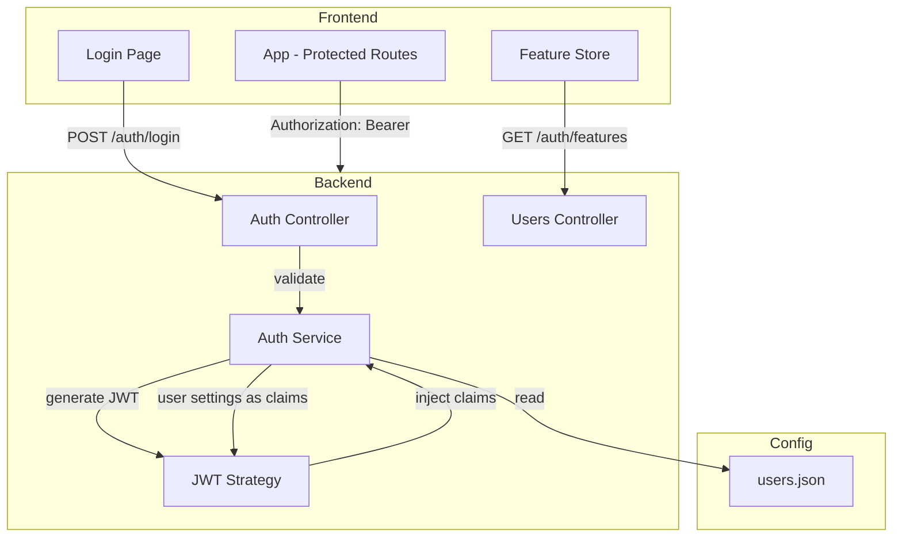

# Auth with Account Settings

## Overview

Implementation of JWT-based authentication with user-specific settings and feature flags for the rt-mcp project.

## Requirements

- User login with username/password
- JWT with configurable expiration and claims
- Configurable list of allowed users
- Per-user custom server settings (JSON)
- Custom JWT token claims based on user settings
- Frontend feature customization via JWT claims
- Frontend query endpoint for user features
- Optional anonymous login via ENV var with built-in "anonymous" user settings

## Architecture



## Implementation Order

| # | Task | Document |
|---|------|----------|
| 1 | JWT Auth Backend | [001-jwt-auth-backend.md](./001-jwt-auth-backend.md) |
| 2 | User Configuration | [002-user-configuration.md](./002-user-configuration.md) |
| 3 | Frontend Auth Integration | [003-frontend-auth.md](./003-frontend-auth.md) |
| 4 | Feature Flags System | [004-feature-flags.md](./004-feature-flags.md) |

## Tech Stack

- Backend: `@nestjs/jwt`, `@nestjs/passport`, `passport-jwt`, `bcrypt`
- Frontend: React Context + Zustand for auth state
- Config: JSON file for user storage (simple, no database needed)

## Configuration Structure

```json
{
  "jwt": {
    "secret": "your-secret-key",
    "expiresIn": "24h"
  },
  "users": [
    {
      "username": "admin",
      "passwordHash": "$2b$10$...",
      "settings": {
        "role": "admin",
        "features": ["search", "download", "settings"]
      }
    }
  ]
}
```

## Anonymous Login

When `ALLOW_ANONYMOUS=true` in environment:
- No login required - frontend skips login form
- Uses built-in "anonymous" user with its settings
- Anonymous user must be defined in `users.json`
- Useful for development or trusted networks

## API Endpoints

| Method | Endpoint | Description |
|--------|----------|-------------|
| POST | `/auth/login` | Login with username/password |
| POST | `/auth/anonymous` | Get token for anonymous user (if enabled) |
| GET | `/auth/me` | Get current user info |
| GET | `/auth/features` | Get user features list |
| GET | `/auth/config` | Get auth config (anonymous allowed, etc.) |

## Security Notes

- Passwords stored as bcrypt hashes
- JWT secret from environment variable
- Token expiration configurable
- No refresh tokens (keep it simple for home project)
