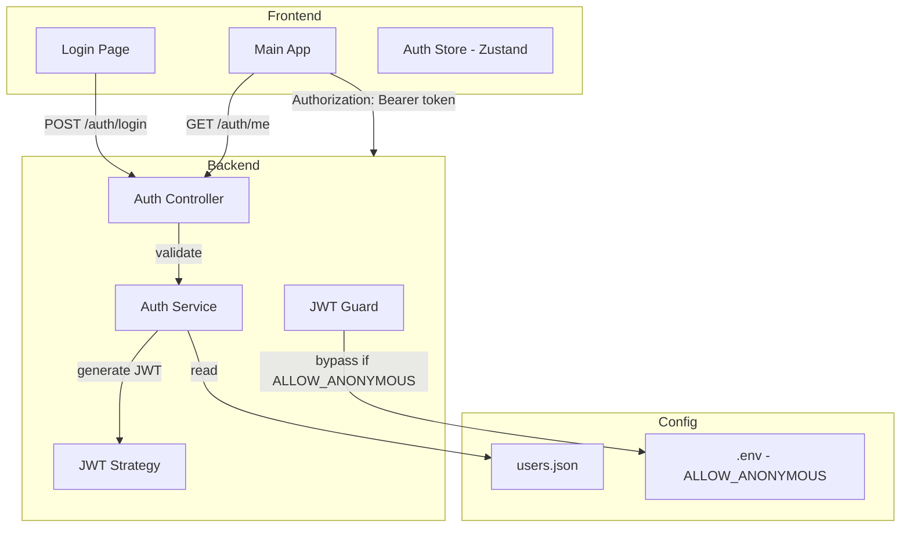

# Auth System

## Overview

JWT authentication for a home project with 2-3 users. Role-based access control.

## Requirements

- User login with username/password
- JWT with 2h expiration
- JSON file for user storage (no database)
- Role-based permissions (admin vs user)
- Optional anonymous mode (skip auth entirely via env var)

## Architecture



## Implementation Order

| # | Task | Document |
|---|------|----------|
| 1 | JWT Auth Backend | [001-jwt-auth-backend.md](./001-jwt-auth-backend.md) |
| 2 | User Configuration | [002-user-configuration.md](./002-user-configuration.md) |
| 3 | Frontend Auth | [003-frontend-auth.md](./003-frontend-auth.md) |
| 4 | Role-Based Permissions | [004-feature-flags.md](./004-feature-flags.md) |

## Tech Stack

- Backend: `@nestjs/jwt`, `@nestjs/passport`, `passport-jwt`, `bcrypt`
- Frontend: Zustand for auth state
- Config: JSON file for users

## User Structure

```json
{
  "users": [
    {
      "username": "admin",
      "passwordHash": "$2b$10$...",
      "role": "admin"
    },
    {
      "username": "user",
      "passwordHash": "$2b$10$...",
      "role": "user"
    }
  ]
}
```

## Anonymous Mode

When `ALLOW_ANONYMOUS=true`:
- Auth guard returns `true` immediately (no JWT validation)
- Frontend skips login page
- Useful for development or trusted home networks
- No fake users or tokens needed

## API Endpoints

| Method | Endpoint | Auth | Description |
|--------|----------|------|-------------|
| POST | `/auth/login` | No | Login, returns JWT + user object |
| GET | `/auth/me` | Yes | Get current user info |
| GET | `/auth/config` | No | Get auth config (allowAnonymous flag) |

## Security Notes

- Passwords: bcrypt with cost 10
- JWT: 7d expiration
- Rate limiting: 5 login attempts per 5 minutes
- Token in localStorage
- No refresh tokens
